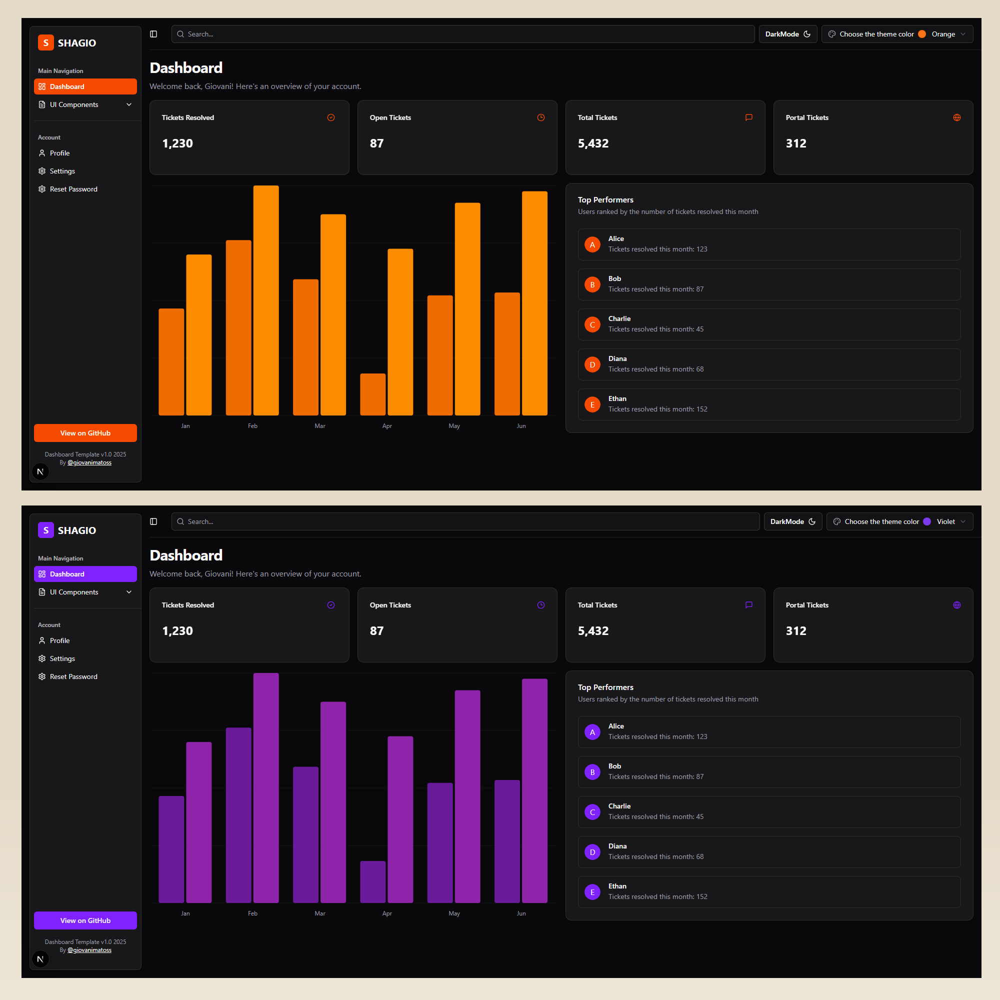
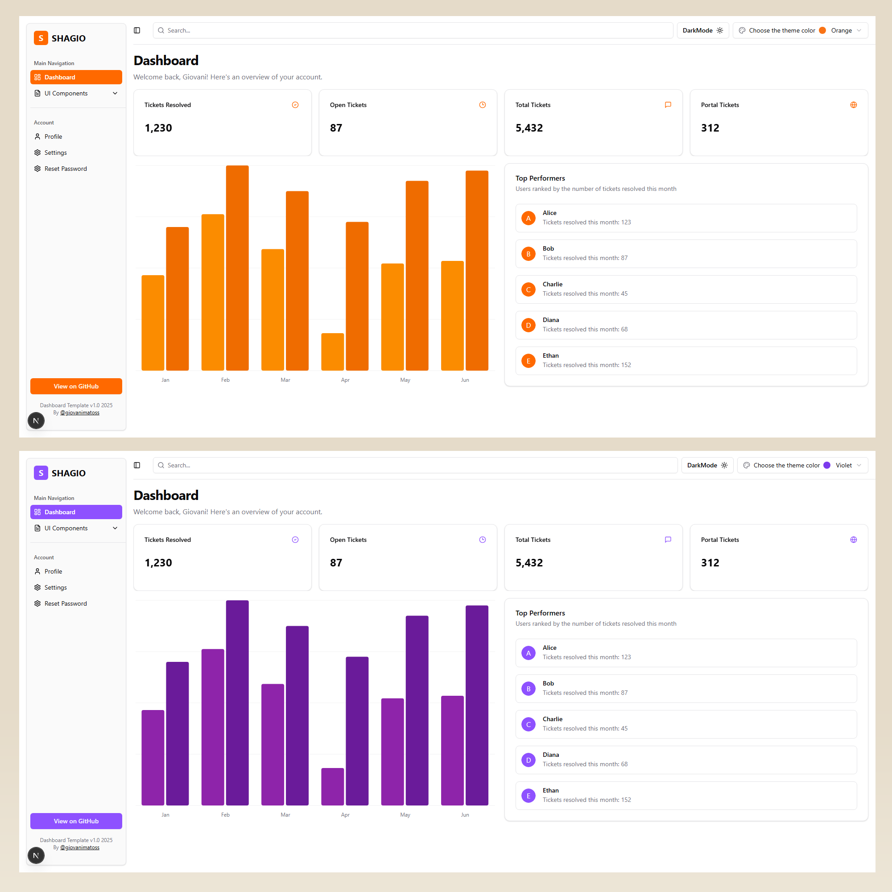
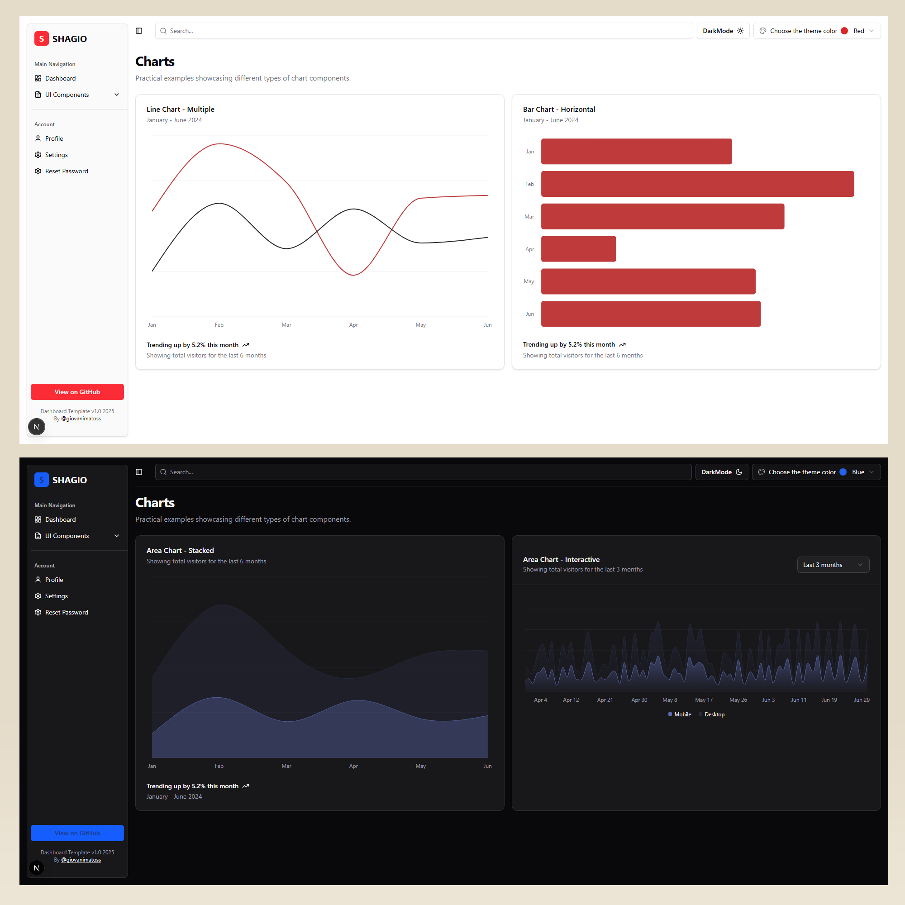
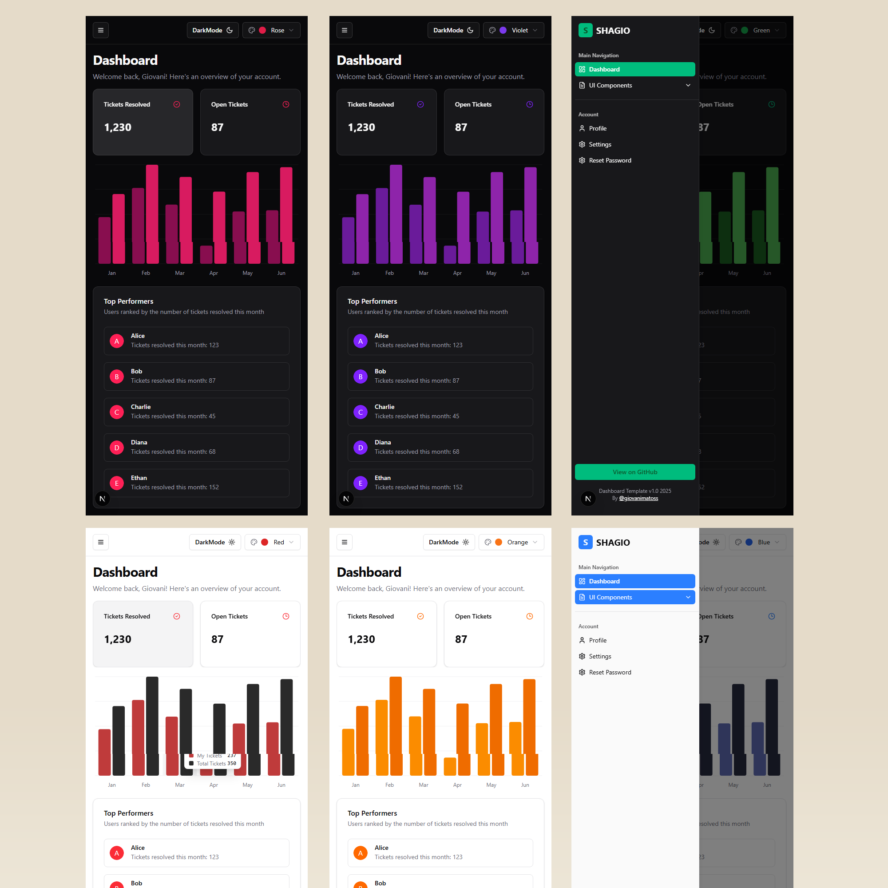

# SHAGIO

**SHAGIO** é um dashboard desenvolvido por mim utilizando as tecnologias mais atuais, como **Next.js 15**, **Tailwind CSS v4** e **Shadcn UI**. O nome vem da junção de **SHADCN** com **Giovani** (meu nome, usando meu apelido).

## Sobre o projeto

Um dashboard moderno que desenvolvi como projeto de estudo, explorando e consolidando meus conhecimentos em Shadcn UI e seus diversos componentes. Feito usando somente a documentação e pude experimentar, testar e consolidar práticas modernas de desenvolvimento de interfaces. Já dá pra dizer que sei um pouco de Shadcn UI e deu pra brincar com alguns componentes. 😄

## Funcionalidades

- Totalmente responsivo
- Estrutura organizada e escalável
- Base para criação rápida de dashboards modernos
- Sistema de **Dark Mode** integrado para melhor experiência visual em ambientes com pouca luz
- Sistema de cores personalizadas onde o usuário pode escolher entre vários temas, melhorando a acessibilidade e adaptando o visual conforme a preferência pessoal

## Versão disponível no GitHub

[\[Versão completa\]](https://github.com/giovanimf/shagiopro)
 
[\[Versão demo ( Em breve )\]](#)

## Telas da versão completa

Aqui estão algumas das imagens da versão completa do dashboard:

## Telas da versão completa

  
  
  
  

## Demo

[\[Link para demo\]](https://shagiopro-el1n.vercel.app/)

## Tecnologias utilizadas

- Next.js 15
- Tailwind CSS v4
- TypeScript
- Shadcn UI
- Zod

---

Obrigado por visitar o projeto! 🚀
